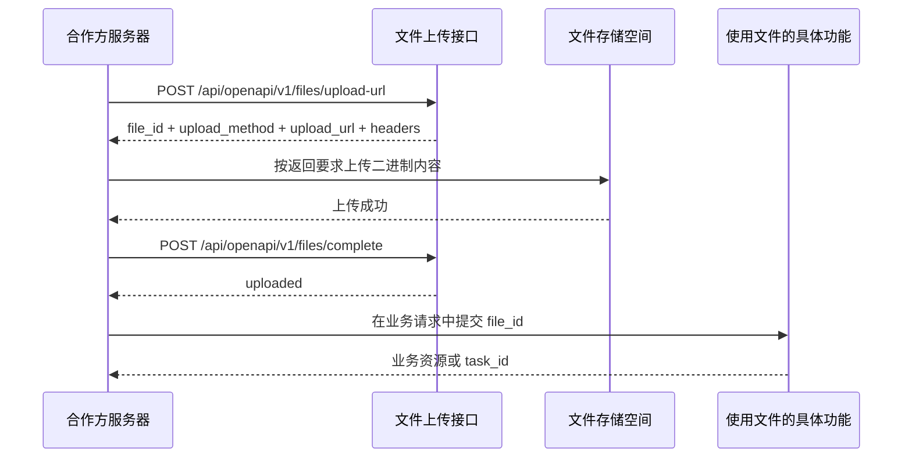

# 文件上传与下载

[在线调试 Swagger](/api/docs) · [返回 API 文档](/api/docs/public-api.md) · [查看原始 Markdown](/api/docs/guides/files/raw.md)

> **v1 范围说明**(新后端,2026-09-08):本文档基于合作方合同原样迁移。v1 后端**支持**:
> `/api/openapi/v1/files/upload-url`(申请上传地址)、`/{file_id}/content`(PUT 写二进制、
> GET 读字节)、`/complete`、`/{file_id}/download-url`、`/{file_id}/preview-url` 全套路由
> (新后端同时保留 `/api/files/**` 第一方路径,两者共用同一文件服务)。存储为**本地磁盘**
> (FILES_STORAGE_DIR),非对象存储;`download-url`/`preview-url` 返回受认证的
> `/api/files/{file_id}/content` 地址(requires_authorization=true、delivery_mode=
> authenticated_api_content_proxy、url_expires_at=null),不返回外部签名直链。
> v1 后端**不支持**:`purpose` 仅 `micro_lesson_question_image` 与
> `micro_lesson_student_solution_image` 两类(其余 exam_page / essay_attachment /
> report_asset / pdf 裁题 / workbook 源 PDF / 微课音频视频等用途调用返回
> `422 UNSUPPORTED_PURPOSE`);非图片内容(试卷/PDF/音频/视频);多租户跨 Client App
> scope。文档中超出该范围的项已标注 v1 不支持。

## 1. 能力说明

文件接口用于上传题图、试卷、PDF、作文附件、音频和视频，也用于预览或下载系统生成的文件。合作方接口统一使用 `Authorization: Bearer <api_key>`；文件始终归属于当前 Client App 和租户，不能跨范围读取。

本页描述合作方后端使用接口密钥调用的通用文件接口。合作方原生 App 使用学生访问令牌时，
走第一方 `/api/files/**` 路径，只能上传小讲师题图，并按合作方应用和原生 App 隔离资源；
上传、下载和预览都继续要求当前 Bearer Token，不返回 OSS 直传或脱离会话的签名直链；
详细规则见[合作方联合登录](/api/docs/guides/partner-sso)和
[小讲师学生问答](/api/docs/guides/small-lecturer-v1)。

## 2. 调用前提

- 上传需要 `file:write` scope。
- 下载和预览需要 `file:read` scope。
- `size_bytes` 必须等于实际上传字节数；建议同时传 SHA-256 校验值。

## 3. 推荐调用时序



1. 申请上传地址并保存 `file_id`。
2. 严格按照返回的地址、方法和请求头上传二进制内容。
3. 调用 `complete`；成功后才能把 `file_id` 交给业务接口。

不要自行拼接上传地址，也不要省略 `complete`。对象存储直传时，上传内容请求通常不携带 EduAgent API Key，只使用 `upload-url` 返回的地址和请求头。

## 4. 接口一览

| 方法 | 路径 | 用途 | Scope |
| --- | --- | --- | --- |
| `POST` | `/api/openapi/v1/files/upload-url` | 创建文件记录并申请上传地址。 | `file:write` |
| `PUT` | `/api/openapi/v1/files/{file_id}/content` | 使用平台内上传地址写入二进制内容。 | `file:write` |
| `POST` | `/api/openapi/v1/files/complete` | 校验并确认文件上传完成。 | `file:write` |
| `GET` | `/api/openapi/v1/files/{file_id}/download-url` | 获取短期下载地址。 | `file:read` |
| `GET` | `/api/openapi/v1/files/{file_id}/preview-url` | 获取短期预览地址。 | `file:read` |

## 5. 申请上传地址

### 请求参数

| 位置 | 字段 | 类型 | 必填 | 默认值 | 示例值 | 说明 |
| --- | --- | --- | --- | --- | --- | --- |
| Header | `Authorization` | string | 是 | - | `Bearer edua_test_xxx` | Client App API Key。 |
| Body | `filename` | string | 是 | - | `question.png` | 原始文件名，长度 1～255。 |
| Body | `purpose` | enum | 否 | `other` | `micro_lesson_question_image` | 文件用途；完整值见下表。 |
| Body | `content_type` | string | 是 | - | `image/png` | MIME 类型。 |
| Body | `size_bytes` | integer | 是 | - | `102400` | 实际文件字节数，必须大于 0。 |
| Body | `checksum_sha256` | string | 否 | - | `9f86d081884c7d659a2feaa0c55ad0159d...` | 64 位十六进制 SHA-256；提供后会在上传时校验。 |
| Body | `metadata` | object | 否 | `{}` | `{"source":"partner_app"}` | 合作方扩展信息，不要放密码、令牌或学生敏感原文。 |

### 文件用途枚举

| 字段 | 可选值 | 中文含义 | 何时使用或出现 | 客户端处理 |
| --- | --- | --- | --- | --- |
| `purpose` | `exam_page` | 试卷页面 | 试卷批改 | 传给试卷批改接口。 |
| `purpose` | `essay_attachment` | 作文附件 | 作文批改补充材料 | 按作文接口约定使用。 |
| `purpose` | `report_asset` | 报告附件 | 报告或导出材料 | 按对应业务接口使用。 |
| `purpose` | `pdf_question_crop_source` | PDF 裁题源文件 | PDF 题目裁切 | 传给裁题接口。 |
| `purpose` | `workbook_source_pdf` | 作业本源 PDF | 作业本生产 | 绑定到作业本课时。 |
| `purpose` | `micro_lesson_portrait` | 微课头像 | 数字人微课 | 作为头像输入。 |
| `purpose` | `micro_lesson_student_audio` | 学生讲解音频 | 数字人微课 | 作为语音输入。 |
| `purpose` | `micro_lesson_question_image` | 微课或小讲师题图 | 题目理解或微课 | 作为单题图片输入。 |
| `purpose` | `micro_lesson_student_solution_image` | 学生解题过程图 | 数字人微课 | 作为手稿或过程输入。 |
| `purpose` | `lecture_evaluation_video` | 学生讲题视频 | 讲题视频评价 | 传给评价接口。 |
| `purpose` | `other` | 其他文件 | 没有专用类型时 | 仅用于明确支持通用文件的接口。 |

### 最小请求示例

```bash
curl -X POST https://edu-test.chiraliumai.cn/api/openapi/v1/files/upload-url \
  -H "Authorization: Bearer <api_key>" \
  -H "Content-Type: application/json" \
  -d '{
    "filename": "question.png",
    "purpose": "micro_lesson_question_image",
    "content_type": "image/png",
    "size_bytes": 102400
  }'
```

响应中的 `file_id` 用于后续确认和业务调用；`upload_method`、`upload_url`、`headers` 必须原样使用。

## 6. 上传内容并确认

上传二进制内容时，请使用上一步返回的地址：

```bash
curl -X PUT "<upload_url>" \
  -H "Content-Type: image/png" \
  --data-binary @question.png
```

确认接口参数：

| 位置 | 字段 | 类型 | 必填 | 默认值 | 示例值 | 说明 |
| --- | --- | --- | --- | --- | --- | --- |
| Header | `Authorization` | string | 是 | - | `Bearer edua_test_xxx` | Client App API Key。 |
| Body | `file_id` | string | 是 | - | `file_01JZ8Q4D3R` | 申请上传地址时返回的文件 ID。 |
| Body | `size_bytes` | integer | 否 | - | `102400` | 再次校验实际大小；提供时必须大于 0。 |
| Body | `checksum_sha256` | string | 否 | - | `9f86d081884c7d659a2feaa0c55ad0159d...` | 再次校验 SHA-256；长度必须为 64。 |

```bash
curl -X POST https://edu-test.chiraliumai.cn/api/openapi/v1/files/complete \
  -H "Authorization: Bearer <api_key>" \
  -H "Content-Type: application/json" \
  -d '{"file_id":"file_xxx"}'
```

## 7. 下载与预览

| 位置 | 字段 | 类型 | 必填 | 默认值 | 示例值 | 说明 |
| --- | --- | --- | --- | --- | --- | --- |
| Path | `file_id` | string | 是 | - | `file_01JZ8Q4D3R` | 当前 Client App 可见的已上传文件 ID。 |

合作方后端使用接口密钥时，下载或预览接口返回短期 URL 及有效期。带签名或 `token` 的 URL
可以在有效期内使用；不要长期保存，也不要转发给无权限用户。

原生 App 使用学生访问令牌时，返回的是受认证的 `/api/files/{file_id}/content` 地址，不是独立
签名短链。响应中的字段含义如下：

| 字段 | 原生 App 返回值 | 说明 |
| --- | --- | --- |
| `requires_authorization` | `true` | 后续读取必须继续携带当前 Bearer Token。 |
| `headers.Authorization` | `Bearer <current access token>` | 占位提示；客户端使用当前真实令牌，不应记录或回传占位文本。 |
| `delivery_mode` | `authenticated_api_content_proxy` | 内容由 EduAgent API 在重新鉴权后代理返回。 |
| `url_expires_at` | `null` | 地址没有独立过期时间；令牌过期、退出或 App 停用后立即不可用。 |
| `head_supported` | `false` | 原生令牌首版不开放 `HEAD`，请使用带 Bearer Token 的 `GET`。 |
| `cache_control` | `private, no-store` | 客户端不应缓存受认证题图响应。 |

原生 App 上传小讲师题图时，服务端不仅检查请求声明的 MIME，还会实际解码图片、核对真实格式、
检查尺寸并限制解码后的总像素数。伪造图片、格式不一致或超大像素图片不会进入后续 OCR/问答。

## 8. 常见错误

| 错误码 | 含义 | 处理方式 |
| --- | --- | --- |
| `FILE_TOO_LARGE` | 申请大小超过环境上限。 | 压缩或拆分文件后重新申请。 |
| `FILE_SIZE_MISMATCH` | 实际上传大小与申请值不同。 | 重新申请上传地址并上传正确文件。 |
| `FILE_CHECKSUM_MISMATCH` | SHA-256 校验失败。 | 不要继续 complete，重新上传。 |
| `FILE_CONTENT_MISSING` | 内容尚未上传或对象存储不可见。 | 确认 PUT 成功后再 complete。 |
| `FILE_NOT_READY` | 文件未完成确认。 | 先完成上传确认。 |
| `NATIVE_FILE_CONTENT_INVALID` | 原生 App 上传内容不是可解码图片。 | 重新选择有效的 PNG、JPEG 或 WebP 图片。 |
| `NATIVE_FILE_CONTENT_TYPE_MISMATCH` | 声明 MIME 与真实图片格式不一致。 | 使用正确 MIME 重新申请并上传。 |
| `NATIVE_QUESTION_IMAGE_PIXELS_EXCEEDED` | 图片解码后的总像素数超过限制。 | 降低图片分辨率后重新上传。 |

## 9. Swagger 试调

在 [Swagger](/api/docs) 中搜索 `files`。先执行 `upload-url`，再按响应地址上传本地文件，最后执行 `complete`；Swagger 只负责申请和确认，二进制直传仍需按返回地址单独执行。
