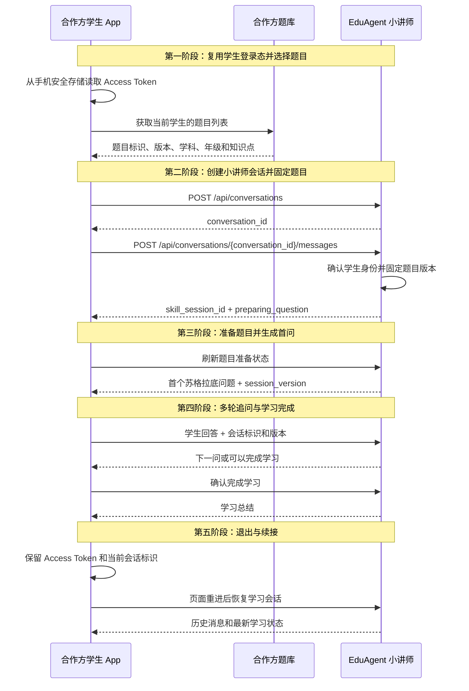

# 小讲师苏格拉底学习 V1

> **v1 范围说明**(新后端,2026-09-08):本文档基于合作方合同原样迁移。v1 后端**支持**:
> Open(题库/题图/文本)、多轮苏格拉底对话、流式、confirm、学习总结、首问策略(answer_status)。
> v1 后端**不支持**:pause / resume / restart / cancel / activate / submit_inputs / diagnose /
> refresh 消息操作(调用返回 400 UNSUPPORTED_ACTION);admin 端点;多租户;年级表达上下文
> v2/v3(年级仍适配,但无独立上下文管理)。文档中这些项已标注"v1 不支持"。

[在线调试 Swagger](/api/docs) · [返回 API 文档](/api/docs/public-api.md) · [查看原始 Markdown](/api/docs/guides/small-lecturer-v1/raw.md)

## 1. 能力说明

小讲师围绕一道固定版本题目，通过多轮追问帮助学生理解思路。学习完成后生成不可变学习
总结，不会自动创建视频、微课或后台任务。

推荐从服务端题库传入 `provider + question_id + question_version`。当前也支持直接输入完整
题目，或上传一张只包含一道清晰印刷题的图片。题图识别试点仅开放小学数学。

讲题视频评分是独立能力，见
[讲题视频智能评价](/api/docs/guides/lecture-evaluations)，不依赖本问答的 `attempt_id`。

### 统一分年级表达策略 v2

小讲师只从服务端可信资料解析 `learner_expression_context/v2`：第一方学生读取当前
`UserProfile.grade`；合作方学生先通过统一身份绑定取得内部 `user_id`，再读取同一资料。
请求参数、题图 OCR、模型输出和自由对话中的年级声明都不能覆盖该上下文。缺少可信资料时
使用 `neutral`，并在 `reason_codes` 中说明原因。

表达上下文在 `Skill Session` 创建或恢复时冻结。同一 `skill_session_id` 内修改用户资料不会
改变语气；新会话才读取更新后的年级。`learner_grade_band` 只控制措辞、句长、提示密度和
抽象程度，题目固定快照中的 `question_grade` 继续控制课程范围、术语、方法和正确性。两者
不一致时返回 `learner_question_grade_mismatch`，互不覆盖。

每轮小讲师输出的 `metadata.output` 包含：

- `learner_expression_context`：冻结的受众角色、年级段、来源、策略版本和原因码；
- `learner_expression_application`：本题年级、是否不一致和当前消费者；
- `expression_policy_applied` 与 `expression_policy_reason_codes`：本轮是否发生可见措辞调整。

例如，小学低年级的短问句“为什么用除法？”会补充为具体数量关系提示；初中学生可以继续
看到规范概念、方程和因果解释。事实、答案、教学判断和证据不会随表达策略改变。学生本轮
急躁、卡住、索要答案或准备退出时，只调整当轮引导强度，不推断人格或长期性格。

## 2. 推荐调用时序



1. 学生已登录；如使用自由题图，先完成文件上传和确认。
2. 创建 Conversation，并显式激活 `small_lecturer_coaching` 提交固定题目。
3. 保存返回的 `skill_session_id` 和 `session_version`；准备期间只刷新该 Skill Session。
4. 每轮回答继续使用同一个 Skill Session，收到 `409` 时先恢复最新版本。
5. 服务端进入可确认状态后提交 `confirm`，从结构化结果读取学习总结。

登录、查询身份和退出登录属于平台公共能力，不属于小讲师技能。合作方学生的登录方式见
[合作方联合登录](/api/docs/guides/partner-sso)。客户端不能自行声明用户、租户或角色。
这些身份和能力查询不会调用小讲师对话模型；只有进入具体题目交互后才执行教学链路。

### 2.1 合作方原生 App 的业务授权

本页从“已经取得 Access Token”开始，不重复联合登录流程。合作方原生 App 调用小讲师接口时
统一携带：

```http
Authorization: Bearer edu_native_<访问令牌>
```

原生 App 必须已开通 `small_lecturer:use`。该 scope 允许当前学生使用本页列出的会话、题图和
学习总结接口，不允许调用未授权的其他业务模块；权限不足或路径不在允许范围内时请求会被拒绝。

## 3. 接口一览

| 方法与路径 | 用途 |
| --- | --- |
| `GET /api/skills/small_lecturer_coaching` | 确认当前学生可使用小讲师。 |
| `POST /api/conversations` | 创建一次题目学习会话。 |
| `GET /api/conversations/{conversation_id}` | 恢复消息和当前结构化交互。 |
| `POST /api/conversations/{conversation_id}/messages` | 激活题目、回答、刷新、暂停、恢复、重开和确认完成。 |
| `POST /api/conversations/{conversation_id}/messages/stream` | 使用安全流式事件完成同样的小讲师操作。 |
| `GET /api/small-lecturer/attempts/{attempt_id}/question-image` | 读取本次学习固定的受保护题图。 |
| `GET /api/small-lecturer/learning-summaries` | 查询当前学生的学习总结。 |
| 文件上传三步接口 | 按需上传题图，`purpose` 使用 `small_lecturer_question_image`。 |

同步消息接口继续兼容；学生聊天页面推荐使用流式接口。小讲师不会把模型原始 token 直接
发送给浏览器，而是依次完成 Skill 状态转换、教学决策、年级表达适配、数学文本与安全语气
门禁以及最终文本持久化，再从同一最终文本生成可读片段。流式、非流式和数据库文本保持一致。
题目列表和题目版本由服务端题库管理，浏览器不能直接写入可信答案、解析或验证状态。

合作方原生 App 使用短期访问令牌上传题图时遵守以下边界：

- `purpose` 必须为 `small_lecturer_question_image`；
- 格式只允许 PNG、JPEG 或 WebP，默认大小上限为 15 MiB；
- 会话和文件同时绑定合作方应用与原生 App，不与其他 App 或 EduAgent 网页端共享；
- 上传、下载和预览均使用受认证的 `/api/files/{file_id}/content`，始终携带当前 Bearer Token；
- 文件预览不返回脱离登录态的签名直链，也不得持久缓存题图。

## 4. 开始一道题

先创建 Conversation，再提交题目标识：

### 创建 Conversation

```http
POST /api/conversations
Content-Type: application/json
```

| 位置 | 字段 | 类型 | 必填 | 默认值 | 示例值 | 说明 |
| --- | --- | --- | --- | --- | --- | --- |
| Body | `title` | string | 否 | - | `五年级数学第 12 题` | 会话标题，最长 200。v1 兼容接收但不落库（统一 Open 不设标题字段）。 |
| Body | `context_snapshot` | object | 否 | `{}` | `{"entry":"question_list"}` | 第一方页面上下文。v1 兼容接收但不落库；不能用来覆盖登录学生、租户或可信年级。 |

### 激活小讲师并提交题目

```http
POST /api/conversations/{conversation_id}/messages
Content-Type: application/json
```

| 位置 | 字段 | 类型 | 必填 | 默认值 | 示例值 | 说明 |
| --- | --- | --- | --- | --- | --- | --- |
| Path | `conversation_id` | string | 是 | - | `conv_01JZ8M2A6X` | 创建 Conversation 后返回的 ID。 |
| Body | `content` | string | 是 | - | `开始学习这道题` | 当前学生可见的输入文本，至少 1 个字符。 |
| Body | `skill_id` | string | 是 | `general_chat` | `small_lecturer_coaching` | 小讲师必须显式填写该值，不能依赖默认值。 |
| Body | `agent_id` | string | 否 | `demo_chat` | `demo_chat` | 宿主兼容字段；小讲师路由以 `skill_id` 和 Skill Session 为准。 |
| Body | `client_turn_id` | string | 否 | - | `turn-math-001-01` | 客户端本轮稳定 ID，长度 1～128。 |
| Body | `idempotency_key` | string | 否 | - | `math-001-attempt-01` | 本轮幂等键，长度 1～128；断线重放时复用。v1 与 `message_idempotency_key` 同义，两者同发以 `message_idempotency_key` 为准。 |
| Body | `input` | object | 否 | `{}` | `{"interaction_action":"activate"}` | Skill Session 操作及结构化输入。 |
| Body | `metadata` | object | 否 | `{}` | `{"entry":"question_list"}` | 页面扩展元数据，不能声明可信身份或答案。v1 兼容接收但不消费。 |
| Body | `input.interaction_action` | enum | 条件必填 | - | `activate` | 首次激活或执行结构化操作时填写；完整值见“操作枚举”。 |
| Body | `input.values.question_source.provider` | string | 条件必填 | - | `school_question_bank` | 使用题库题目时必填。**v1 不支持**（题目经统一 Open 提交，见下）——v1 请求携带 `input.values.*` 返回 422。 |
| Body | `input.values.question_source.question_id` | string | 条件必填 | - | `math-001` | 使用题库题目时必填。**v1 不支持**（题目经统一 Open 提交）——v1 请求携带返回 422。 |
| Body | `input.values.question_source.question_version` | string | 条件必填 | - | `2026-v3` | 使用题库题目时必填，本次会话内固定。**v1 不支持**（题目经统一 Open 提交）——v1 请求携带返回 422。 |
| Body | `input.question_text` | string | 条件必填 | - | `解方程 3x+7=25` | 直接输入完整题目时使用。**v1 不支持**（完整题目走统一 Open 的 `question_text`）——v1 请求携带返回 422。 |

> **v1 字段白名单（#202/#207）**：请求体只接收本表与 §5 字段表列明的键，未知键一律
> 422（`未知字段:…`，不是静默忽略）。上表 `input.values.*` / `input.question_text`
> 属激活/补充材料流程，与操作枚举「v1 不支持」一致：发送即 422。

### 操作枚举

v1 支持的操作(v1 不支持的操作调用返回 400 UNSUPPORTED_ACTION):

| 字段 | 可选值 | 中文含义 | v1 状态 | 客户端处理 |
| --- | --- | --- | --- | --- |
| `input.interaction_action` | `confirm` | 确认完成 | **支持** | 生成不可变学习总结。 |
| `input.interaction_action` | *(省略/普通对话)* | 普通对话 | **支持** | 提交学生回答,返回下一问。 |
| `input.interaction_action` | `activate` | 激活小讲师 | **v1 不支持**(统一 Open 覆盖) | — |
| `input.interaction_action` | `submit_inputs` | 提交补充材料 | **v1 不支持** | — |
| `input.interaction_action` | `diagnose` | 提交回答并诊断 | **v1 不支持** | — |
| `input.interaction_action` | `refresh` | 刷新状态 | **v1 不支持**(用专用 refresh 端点) | — |
| `input.interaction_action` | `pause` | 暂停学习 | **v1 不支持** | — |
| `input.interaction_action` | `resume` | 继续学习 | **v1 不支持** | — |
| `input.interaction_action` | `restart` | 重新开始 | **v1 不支持**(新幂等键新建会话) | — |
| `input.interaction_action` | `cancel` | 取消本次任务 | **v1 不支持** | — |

```json
{
  "skill_id": "small_lecturer_coaching",
  "content": "开始学习这道题",
  "input": {
    "interaction_action": "activate",
    "values": {
      "question_source": {
        "provider": "school_question_bank",
        "question_id": "math-001",
        "question_version": "2026-v3"
      }
    }
  }
}
```

> **v1 提示**：上例为完整合同形状，保留作未来版本参考；v1 激活由统一 Open 覆盖
> （操作枚举同款结论），按此形状发送会得到 422 未知字段。

三个题目标识缺一不可。题目版本在本次学习开始后固定，题库更新不会改变进行中的记录。

准备期间响应为：

```text
interaction.kind = progress
interaction.progress.phase = preparing_question
```

前端可以立即打开对话框，并使用同一消息接口提交 `interaction_action=refresh`。准备时间超过
十秒时展示等待提示，不应丢弃会话或切换为通用聊天。

### 直接输入完整题目

完整题目在 v1 走统一 Open 的 `question_text`（body 级字段，`POST /api/prepared-questions/open` 或 `POST /api/conversations`），原子创建会话并出首问：

```json
{
  "idempotency_key": "math-001-attempt-01",
  "question_text": "解方程 3x+7=25"
}
```

> 旧消息面形状（`input.question_text`）属激活流程，v1 不支持——发送返回 422 未知字段。

### 上传题图

先通过统一文件接口上传题图，再在统一 Open 提交 `file_id`（body 级 `question_image`）：

```json
{
  "idempotency_key": "math-001-attempt-01",
  "question_image": "file_xxx"
}
```

> 旧消息面形状（`interaction_action=submit_inputs` + `input.values.question_image`）
> 属补充材料流程，v1 不支持——发送返回 422 未知字段。

服务端会校验文件归属和图片文件完整性；OCR 只作为辅助信息，不能单独否定一张可用题图：

- 文件不存在、归属错误、上传未完成或不是图片时，保持题目准备失败状态，并记录稳定错误码、
  安全摘要和关联资源 ID；本轮不承诺同一会话内重新上传恢复。
- 图片识别通过后保存识别文字作为辅助证据，并保存题图引用、内容哈希和题目指纹；
  OCR 结果缺失时仍以题图多模态理解为准，识别文字不能替代权威题图。
- `question-image-check` 是只读的文件、模型可用性和辅助 OCR 预检，不等于已经可以开始问答。
  Skill 会话收到题图后还会执行最终构图门禁：如果图片包含学校或账号信息、导航栏、资源列表、
  聊天面板、按钮、输入框等应用界面，即使局部包含题目，也会停留在 `review_required`，提示学生
  重新裁剪；该路径不会创建 `teaching_context_compile_job`。
- 固定题库题图和第一方上传的自由单题图都会在教学上下文准备阶段进入多模态理解，
  生成结构化题干、知识点、图表证据、候选答案和推理步骤。自由题图必须绑定上传文件
  哈希，不把 OCR 文本当作权威题干。
- 题图准备采用“先首问、后完整上下文”的可审计阶段：一次 `question_image_understanding`
  视觉调用同时确认图片不是整页应用截图并提取单题或同题复合小问、非空结构化题干。
  视觉理解结果持久化后，服务端可以立即自动发送不泄露答案的首问，
  例如确认题目要求或已知条件；首问不创建答案判断依据，也不调用学生诊断模型。
- 首问之后，`teaching_context_compile` 根据结构化理解和题库来源编译完整教学上下文；第二阶段
  不再重复发送原始题图。编译重试时直接复用视觉理解结果，不会因为文字模型暂时失败而重复识别图片。
  每个阶段都经过模型网关能力门禁并记录调用来源。答案判断、纠错、关键提示和学习完成门禁使用
  权威上下文；但模型推导答案、语义复核不可用或复核独立性不足，只作为 `review_required` 质量告警
  记录，不阻断已有最小理解产物支持的首问和苏格拉底式交流，也不会把答案或掌握程度标记为已验证。
- 只有构图门禁、`question_image_understanding`、文件归属/哈希、题目范围或最小理解产物失败时，
  助手消息才会进入阻断状态；服务端会记录失败阶段、错误码和安全摘要，不应把这次失败显示成题图
  已准备完成，也不会创建题目尝试。教学编译或语义复核的暂时故障如果不影响最小理解，会保留可恢复
  的告警状态，优先让学生继续对话，后台记录后续恢复依据。
- 多模态理解会区分单题、同一题的复合小问和多道独立题；多道独立题或范围无法判断时
  不会启动问答，需要重新选择或整理题目。
- 题库未提供答案或题目来自自由题图时，几何、公式、图表、复杂图形、证据不足或解法有
  歧义等高风险候选答案需要独立的题图语义复核；低风险题通过结构化质量门禁后可继续准备。
  需要复核但复核失败时进入 `review_required`：服务端记录问题和证据，但只要最小题目理解完整，
  学生仍可以继续首问和苏格拉底式引导；系统不会让通用聊天模型猜题，也不会把答案或掌握程度标记为已验证。
- 自由题图只有在构图、文件归属/完整性、题目范围或最小理解失败时才进入阻断性的 `failed`；
  仅因模型推导答案、语义复核不可用或复核独立性不足而进入的 `review_required` 是可对话告警。
  两类状态都保留错误码和错误摘要供日志、运营和后续恢复能力使用；本轮不把同一会话内重新上传
  作为对外承诺。固定题目仍不允许通过输入替换，避免把已固定的题源偷偷改成另一道题。

前端不单独调用 OCR，也不能把学生输入、OCR 文本或首次模型输出标记为可信答案解析。

题图归属有两个不同的命名空间，前端不需要自行填写：题目快照的 `client_id` 表示题源缓存
范围，题图引用的 `owner_client_id` 和文件记录的 `client_id` 表示实际文件所有权。服务端迁移
历史原生 App 资源时只修复文件所有权，不改写题源缓存范围。

### 安全流式事件

流式接口返回服务器发送事件，前端按以下顺序处理：

| 事件 | 中文含义 | 前端处理 |
| --- | --- | --- |
| `start` | 本轮已接收 | 保存服务端用户消息 ID。 |
| `status` | 当前准备阶段 | 展示“正在理解题目”“正在检查解法”等短提示。 |
| `interaction` | 权威 Skill 状态 | 更新 `skill_session_id`、`session_version` 和可用操作。 |
| `delta` | 已校验的可见文本片段 | 追加到当前回答气泡。 |
| `done` | 本轮完成 | 使用完整消息替换本地临时消息。 |
| `error` | 本轮失败 | 保留输入；可重试错误继续使用原幂等键。 |

`interaction` 必须先于 `delta`。断线后服务端继续完成并持久化本轮；客户端使用相同幂等键
重放时得到同一组消息和权威 interaction，不会重复诊断。

## 5. 多轮回答

每个成功响应都会返回完整 `skill_interaction/v1`。后续回答必须带回当前
`skill_session_id` 和 `session_version`：

### 多轮请求参数

| 位置 | 字段 | 类型 | 必填 | 默认值 | 示例值 | 说明 |
| --- | --- | --- | --- | --- | --- | --- |
| Body | `content` | string | 是 | - | `我想先把等式两边都减去 7。` | 学生本轮原始回答，也是服务端实际用于诊断和追问的回答文本。 |
| Body | `skill_id` | string | 是 | `general_chat` | `small_lecturer_coaching` | 固定为该值。 |
| Body | `client_turn_id` | string | 否 | - | `turn-math-001-02` | 每轮使用新的客户端回合 ID。 |
| Body | `idempotency_key` | string | 否 | - | `math-001-answer-02` | 同一轮网络重试必须复用。 |
| Body | `input.skill_session_id` | string | 是 | - | `skillsess_01JZ8M4K9P` | 首轮 interaction 返回的 Skill Session ID。 |
| Body | `input.expected_session_version` | integer | 是 | - | `7` | 当前 interaction 的版本号，用于并发控制。 |

页面刷新后若 interaction 缺失，可调用：

```http
POST /api/conversations/{conversation_id}/skill-sessions/{skill_session_id}/refresh
```

该接口没有请求体，只刷新权威 Skill 状态，不创建新的学生消息。

```json
{
  "skill_id": "small_lecturer_coaching",
  "content": "我想先把等式两边都减去7。",
  "input": {
    "skill_session_id": "skillsess_xxx",
    "expected_session_version": 7
  }
}
```

关键规则：

1. 同一次学习始终使用同一个 `skill_session_id`。
2. 页面刷新后从 Conversation 历史恢复 `interaction`，不要猜测“最新的小讲师会话”。
3. 旧版本或并发回答返回 `409 SKILL_SESSION_CONFLICT`；前端读取错误中的最新 interaction
   后继续。
4. interaction 缺失时只刷新一次；仍无法恢复则提示重新开始，不能静默降级为
   `general_chat`。

## 6. 状态与操作

### Skill Session 状态

| 字段 | 可选值 | 中文含义 | v1 状态 | 客户端处理 |
| --- | --- | --- | --- | --- |
| `interaction.state` | `collecting_inputs` | 收集题目或学生回答 | 支持 | 提交回答。 |
| `interaction.state` | `ready_to_confirm` | 可以确认完成 | 支持 | 展示确认入口,也可继续回答。 |
| `interaction.state` | `completed` | 已完成 | 支持 | 读取 `interaction.result`。 |
| `interaction.state` | `paused` | 已暂停 | v1 不支持 | — |
| `interaction.state` | `executing` | 正在执行确认后的任务 | v1 不支持 | — |
| `interaction.state` | `incomplete` | 当前证据不足 | v1 不支持 | — |
| `interaction.state` | `failed` | 处理失败 | 支持 | 保留记录,根据错误码重试或反馈。 |
| `interaction.state` | `cancelled` | 已取消 | v1 不支持 | — |

### 学习尝试状态

| 字段 | 可选值 | 中文含义 | v1 状态 | 客户端处理 |
| --- | --- | --- | --- | --- |
| `interaction.attempt_state` | `diagnosing` | 正在判断理解层次 | 支持 | 展示当前问题并等待回答。 |
| `interaction.attempt_state` | `scaffolding` | 正在分步引导 | 支持 | 继续同一题的追问。 |
| `interaction.attempt_state` | `ready` | 掌握证据已足够 | 支持 | 展示完成确认。 |
| `interaction.attempt_state` | `completed` | 学习总结已写入 | 支持 | 读取总结。 |
| `interaction.attempt_state` | `needs_review` | 结果需要复核 | 支持 | 不展示为已掌握。 |
| `interaction.attempt_state` | `paused` | 学习已暂停 | v1 不支持 | — |
| `interaction.attempt_state` | `stopped` | 本次学习已停止 | v1 不支持 | — |

前端只提交服务端 interaction 中提供的操作:

- `confirm`:确认完成并写入 `small_lecturer_learning_summary/v1`。
- (v1 不支持 pause/resume/restart/cancel,新幂等键新建会话。)

## 7. 提问与显示规则

- 每轮只显示一个主问题。
- 最多计入 6 个有效追问；准备提示和系统错误不计数。
- 不提前给出最终答案。
- 学生受阻时降低跨度或更换角度，并说明新问题与上一问的关系。
- 前端直接展示 `assistant_message.content`；`metadata.output.next_prompt` 只表示主问题。

学生可见数学表达使用普通文本符号，例如 `3x+7=25`、`×`、`÷`、`√`、`≤`，不要求前端
安装 KaTeX 或 MathJax。服务端会清理常见 LaTeX 分隔符和白名单命令，同时保留金额 `$5`
和普通文本。前端必须继续 HTML 转义，不能把模型文本直接写入不受控 `innerHTML`。

## 8. 学习总结

完成卡片读取：

```text
interaction.result.learning_summary
```

不要从聊天文案反向解析总结。历史记录查询：

```http
GET /api/small-lecturer/learning-summaries
    ?provider=school_question_bank
    &question_id=math-001
    &question_version=2026-v3
```

| 位置 | 字段 | 类型 | 必填 | 默认值 | 示例值 | 说明 |
| --- | --- | --- | --- | --- | --- | --- |
| Query | `provider` | string | 是 | - | `school_question_bank` | 题库来源标识。 |
| Query | `question_id` | string | 是 | - | `math-001` | 题目标识。 |
| Query | `question_version` | string | 否 | - | `2026-v3` | 指定题目版本；省略时按接口当前查询语义返回。 |

总结包含 `attempt_id`、题目标识和版本、`mastery_status`、`evidence_summary`、创建时间。
同一道题再次学习会生成新的 attempt 和总结，不覆盖历史记录。

## 9. 错误处理

| 状态码或错误码 | 处理方式 |
| --- | --- |
| `401` | 恢复或重新建立平台登录态。 |
| `403 NATIVE_SESSION_SCOPE_DENIED` | 当前原生 App 未开通 `small_lecturer:use`，联系管理员配置权限。 |
| `403 NATIVE_SESSION_ROUTE_FORBIDDEN` | 当前原生 Access Token 不能调用该路径，停止请求并检查对接接口。 |
| `404` | 题目或学习记录不存在，或当前学生无权访问。 |
| `409 SKILL_SESSION_CONFLICT` | 使用错误响应中的最新 interaction 刷新界面。 |
| `409 SKILL_SESSION_VERSION_REQUIRED` | 补充当前 `expected_session_version` 后重试，不能忽略并发控制。 |
| `409 CONVERSATION_MESSAGE_IDEMPOTENCY_CONFLICT` | 同一幂等键对应了不同消息内容；修正调用方幂等实现。 |
| `409 CONVERSATION_MESSAGE_IN_PROGRESS` | 同一幂等请求仍在处理；等待后使用原幂等键查询或重放。 |
| `413 NATIVE_QUESTION_IMAGE_PIXELS_EXCEEDED` | 题图解码后像素过大，压缩分辨率后重新上传。 |
| `415 NATIVE_FILE_CONTENT_INVALID` | 上传内容不是可解码的 PNG、JPEG 或 WebP 图片。 |
| `415 NATIVE_FILE_CONTENT_TYPE_MISMATCH` | 声明的图片类型与实际内容不一致，修正后重新上传。 |
| `422` | 修正题目标识或消息输入。 |
| `503` | 保留当前学习记录，稍后重试。 |

旧的、不完整诊断记录不能继续使用；服务端会要求重新开始，而不是根据截断摘要继续提问。

## 10. Swagger 试调

1. 先用已登录的测试学生会话在 [Swagger](/api/docs) 创建 Conversation。
2. 激活小讲师时显式传 `skill_id=small_lecturer_coaching`，记录响应中的 `skill_session_id` 和版本号。
3. 连续发送至少三轮回答，确认每轮 `assistant_message.skill_id` 和 `skill_session_id` 不变。
4. Swagger 能验证请求合同；页面刷新、SSE 流式顺序和数学文本显示仍需在真实学生页面验证。
