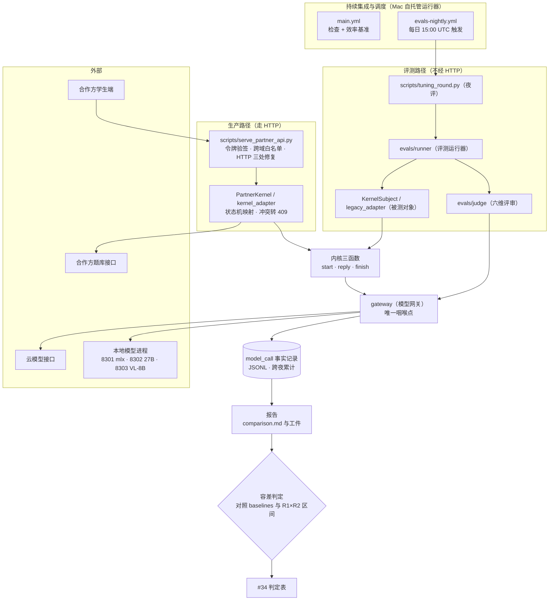
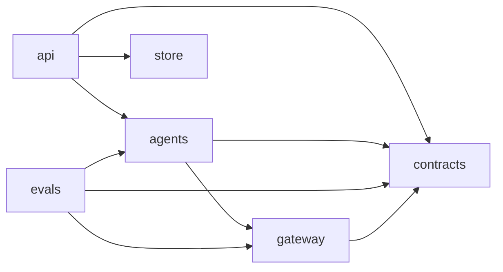
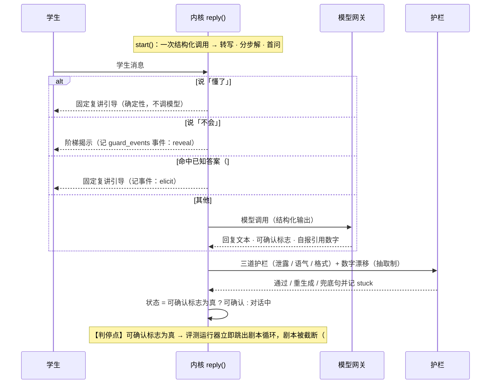
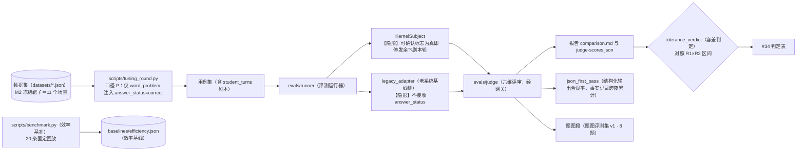
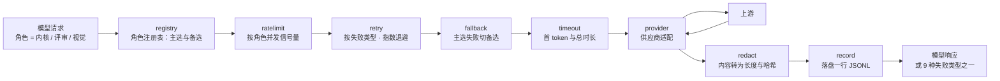
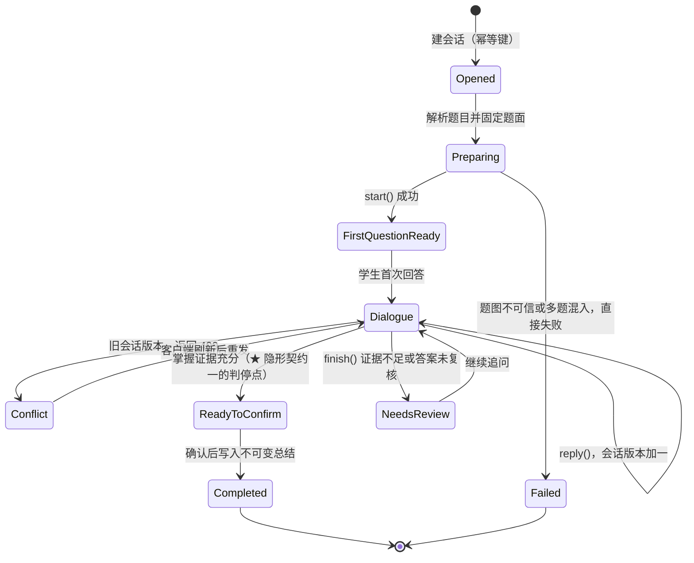

# 03 整体架构图

状态：**M2 收尾对齐**（2026-09-10）；最后核对 commit：`b5b9c77`。

读法：**第 1 节是全景观（首屏）**，其后按"从外到内"排：分层依赖 → 教学时序 → 评测数据流 →
**隐形契约清单** → gateway 中间件链 → 会话状态机 → 与老仓库对照。
图中**只保留必要名称**（文件路径 / 类名 / 合同名 / 状态名 / 命令），其余一律中文。
每张图下方挂「**校验源**」——图与代码同源可查；文末有「如何验证本图仍成立」。

## 1. 全景观（上下文与部署）



**要点**（相对 2026-09-06 草案的更新：接口层已实现、不再是 M3 虚线；新增夜评与调度、模型端口）

- **一个咽喉点**：所有模型调用经模型网关（gateway）；内核与评审器都不直接碰模型供应商。
- **两条路径**：生产走 HTTP（`serve_partner_api.py`）；**评测不经 HTTP**，评测运行器直调内核三函数。
- **网关只是 HTTP 客户端**：本地模型进程独立，生死不归 Python 管。
- **事实记录是唯一审计源**：效率、稳定性、结构化输出合规率全部从 `model_call` JSONL 汇总，不另建观测后台。

> 校验源：`scripts/serve_partner_api.py`、`configs/models.yaml`、`.github/workflows/{main,evals-nightly}.yml`

## 2. 分层依赖（可执行的四条合同）



（图为 6 个包的**合法依赖方向**；包名与合同名为必要名称，故不译。）

| 合同（`import-linter`） | 禁止 |
|---|---|
| `gateway-no-agents-evals-api-store` | 网关不得依赖内核、评测、接口层、存储 |
| `agents-no-api-store` | 内核不得依赖接口层、存储 |
| `evals-no-api` | 评测不得依赖接口层 |
| `contracts-imports-nothing-internal` | 合同包不依赖任何内部包 |

> 校验源：`uv run lint-imports`（红灯测试 `tests/rules/test_import_contracts.py`）

## 3. 教学时序（含三护栏与判停点）



> 校验源：`edu_agent/agents/small_lecturer/kernel.py`、`tests/teaching/`（157 例，零跳过）

## 4. 评测数据流（含口径注入点）



另有三套口径并存：**P**（判门口径，夜评用）、**F**（生产同构，唯一能触发五步弧线）、
**R**（修复对照口径）——引用任何数字前先确认口径（历史上最容易混淆的一处）。

> 校验源：`scripts/tuning_round.py`、`edu_agent/evals/`、`baselines/efficiency.json`

## 5. 隐形契约清单（**本版新增，最重要**）

这些语义**不在任何报告里出现**，只能读代码或数工件才知道——上一轮定位一个判门失败场景，
代价是8 次工具调用 + 通读 4 个模块：

| # | 隐形契约 | 位置 | 后果 |
|---|---|---|---|
| 1 | **剧本截断**：可确认标志为真即停发余下剧本轮 | `evals/kernel_subject.py` | 4 轮剧本可能只跑 2 轮，报告不可见 |
| 2 | **口径注入不对称**：`answer_status` 只给内核侧 | `scripts/tuning_round.py:117` | 该场景对我们比基线更难（待裁定 → #152） |
| 3 | **护栏「无答案模式」**：评测不传答案 | `KernelSubject` 与内核放宽分支 | 评测泄露数字不等于生产；`_known_answer` 的分步解兜底**未接到护栏**（#149 第②项） |
| 4 | `minimum_student_turns` 无人读取 | 数据集 JSON | 装饰性元数据；"最少四轮"从未被强制 |
| 5 | 事实记录跨夜累计（`EDU_FACTS_DIR`） | `evals-nightly.yml` | 合规率分母是**累计样本**（134 而非 67） |
| 6 | 评审器单遍、温度为 0 | `configs/models.yaml` | 同输入判定确定 → 11 个场景跨帧逐项同值（已实证） |
| 7 | 评测不跑 HTTP；事实记录为唯一审计源 | 架构约定 | 生产路径的 HTTP 行为不由评测覆盖 |

## 6. 模型网关的中间件链



每个中间件单独可测；故障注入用假上游逐一触发 9 种失败类型（PR 持续集成只跑故障注入，不测真实延迟）。

> 校验源：`tests/gateway/`、`.github/workflows/ci.yml`

## 7. 小讲师会话状态机（对应合作方接口合同）



状态名（必要名称，与老仓库合同逐字对应）释义：Opened＝已开启，Preparing＝准备中，
FirstQuestionReady＝首问就绪，Dialogue＝对话中，NeedsReview＝待复盘，ReadyToConfirm＝可确认，
Completed＝已完成，Failed＝失败。旧版本状态在内存（接口层已实现）；存储落在 M3。

## 8. 与老仓库的对照

| 维度 | 老仓库 | 本仓库 |
|---|---|---|
| 顶层包 | 30+ | 6 |
| 模型调用 | gateway 2333 行 + worker 边车 + 进程内引擎 + 6 种 provider | 网关注干中间件 + 两种供应商，本地模型进程外 |
| 对外接口 | 通用对话 + 技能信封 + 专用流程并存 | 专用流程路径已实现（`serve_partner_api.py`），内核纯函数 |
| 评测 | 依赖数据库、后台、身份服务 | 直调内核，JSONL 进 JSONL 出；夜评每日一帧 |
| 观测 | 自建流量页、链路页、调用表十几个维度 | JSONL 事实记录 + 夜评报告 |
| 治理 | 113 行宪法 + 本地持续集成仪式 + 棘轮豁免 | 一页规则 + 硬预算无豁免 + PR 关卡 |

## 9. 如何验证本图仍成立

```bash
make check                                   # 测试 / 合同 / 预算 / 结构全绿
uv run lint-imports                          # 第 2 节的四条依赖合同
gh run list --workflow nightly --limit 3     # 第 1、4 节的夜评线是否仍在跑
gh pr view <n> --json files                  # 改动是否落在本图所示模块
```

改图时请同步更新文首的「最后核对 commit」。**不做**图自动生成与持续集成校验图（收益低于成本）。
