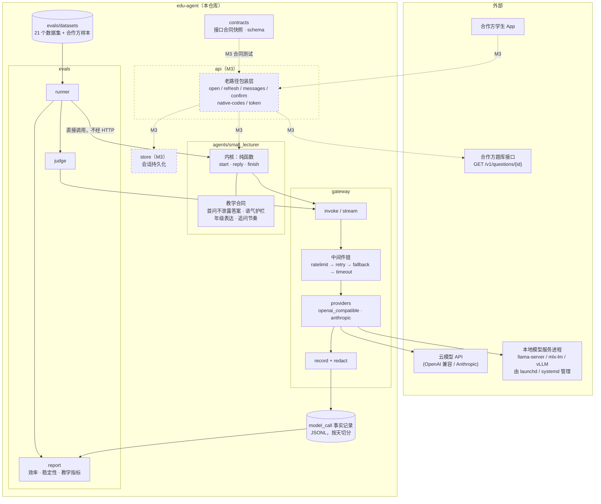
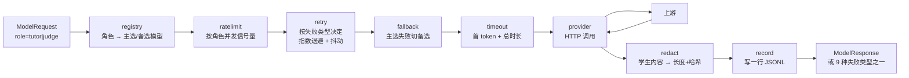
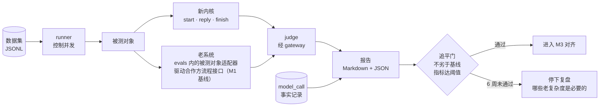
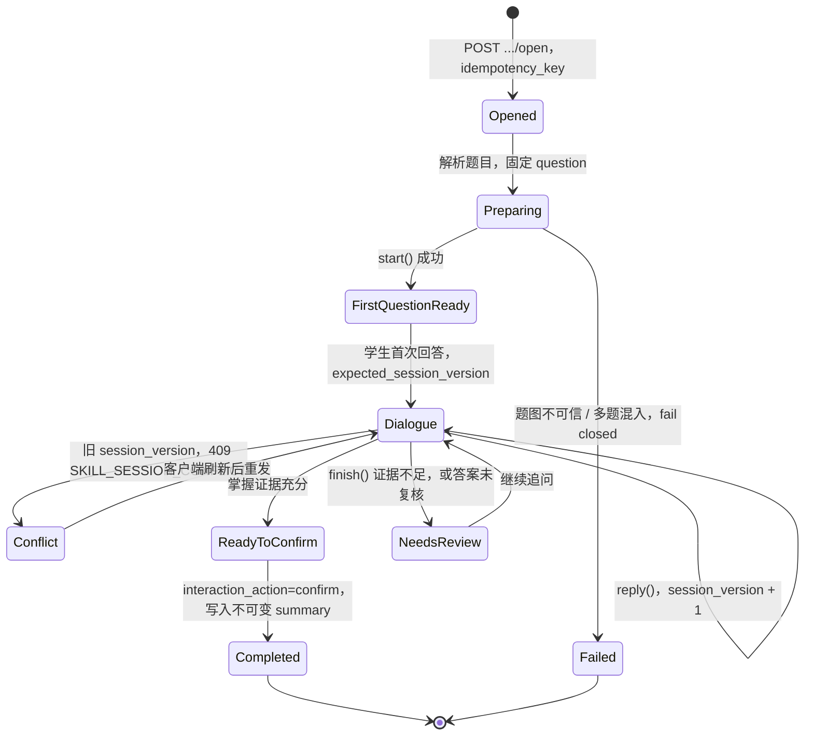

# 03 整体架构图

状态：草案（2026-09-06）。图中实线部分是 v1（M0–M2）范围，虚线部分在 M3 才实现。

## 1. 整体架构

要点：

- **一个咽喉点**：所有模型调用经 gateway，agent 与 judge 都不直接碰 provider。
- **评测不经 HTTP**：runner 直接调内核三个函数，所以 v1 没有 api 层也能跑通评测。
- **gateway 只是 HTTP 客户端**：本地模型服务是独立进程，进程生死不归 Python 管。
- **事实记录是唯一审计源**：效率与稳定性指标全部从 JSONL 汇总，不另建观测后台。

## 2. gateway 中间件链

每个中间件单独可测；故障注入测试用假上游服务器逐一触发 9 种失败类型，断言链上每一环的行为。

## 3. 评测线流程

## 4. 小讲师会话状态机（对应合作方接口合同）

状态与老仓库合作方文档中的 `first_question_ready`、`session_version`、`ready_to_confirm`、
`completed`、`needs_review` 一一对应。v1 状态在内存，M3 落到 store。

## 5. 与老仓库的对照

| 维度 | 老仓库 | 本仓库 |
|---|---|---|
| 顶层包 | 30+ | 6 |
| 模型调用 | gateway 2333 行 + worker 边车 + 进程内引擎 + 6 种 provider | gateway 若干中间件 + 2 个 provider，本地模型进程外 |
| 对外接口 | 通用对话 + skill 信封 + 专用流程并存 | 只保留专用流程路径，内核纯函数 |
| 评测 | 依赖数据库、后台、身份 | 直接调内核，JSONL 进 JSONL 出 |
| 观测 | 自建流量页、trace 页、model_calls 表 十几个维度 | JSONL 事实记录，需要时 DuckDB 查 |
| 治理 | 113 行宪法 + Local CI 仪式 + 棘轮豁免 | 一页规则 + 硬预算无豁免 |
