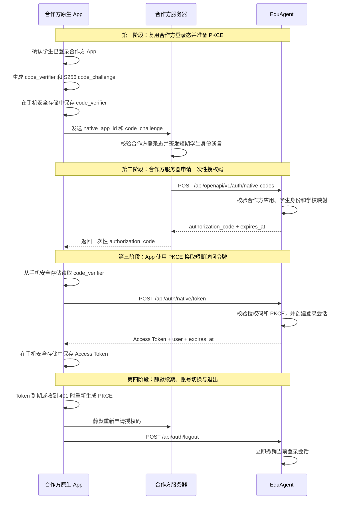
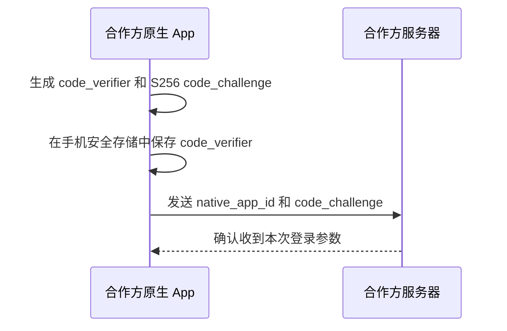
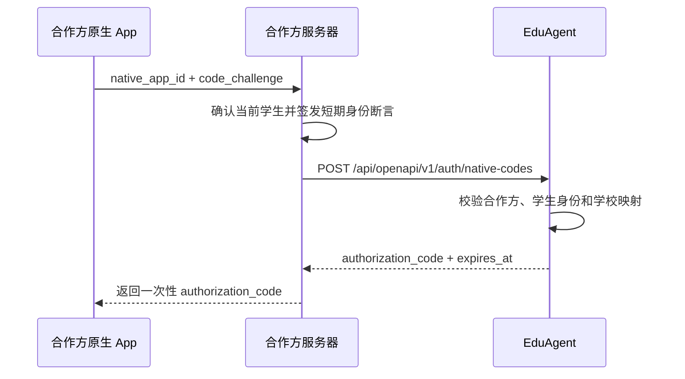
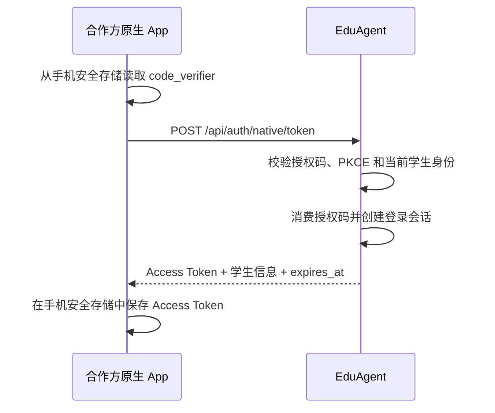
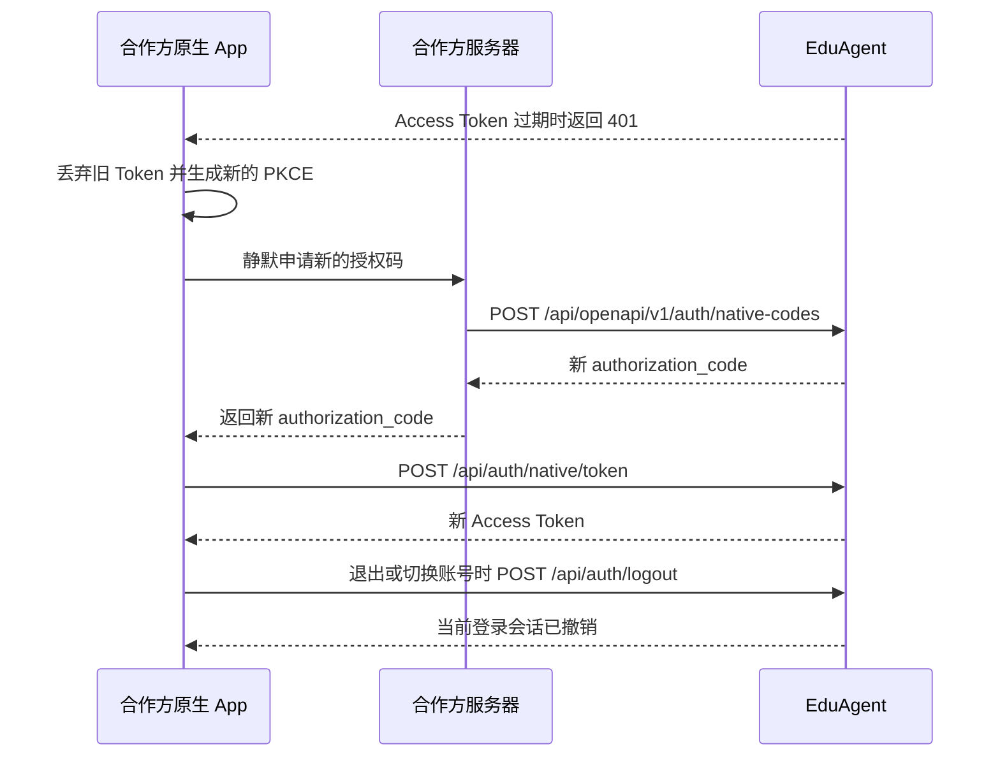

# 合作方联合登录

[在线调试 Swagger](/api/docs) · [返回 API 文档](/api/docs/public-api.md) · [查看原始 Markdown](/api/docs/guides/partner-sso/raw.md)

## 1. 先选择接入方式

EduAgent 目前保留两套互不混用的登录方式：

| 使用场景 | 推荐方式 | 登录凭据 | 是否打开浏览器 |
| --- | --- | --- | --- |
| 合作方原生 App | 一次性授权码 + PKCE | 短期不透明访问令牌 | 否 |
| EduAgent 自有网页 | 网页单点登录 | HttpOnly Cookie | 是 |

合作方原生 App 已经拥有自己的学生登录态时，应使用第一种方式。App 不接触合作方接口密钥
和学生身份断言，也不打开系统浏览器或 WebView。原先按题目签发浏览器登录地址的入口已经
下线，不应继续调用。

### 1.1 五个关键值

| 名称 | 谁产生 | 用途 |
| --- | --- | --- |
| 合作方接口密钥 | EduAgent 提供 | 合作方服务器调用授权码接口时证明应用身份。 |
| `assertion` | 合作方服务器生成 | 证明“当前是哪名学生”，App 不接触。 |
| `code_verifier` / `code_challenge` | App 生成 | 将授权码绑定到本次 App 登录，防止授权码被截获后冒用。 |
| `authorization_code` | EduAgent 生成 | 只能使用一次的短期授权码，由合作方服务器转交 App。 |
| `access_token` | EduAgent 生成 | App 登录成功后的短期凭据，用于调用已授权的 EduAgent 业务接口。 |

## 2. 合作方需要预先提供的信息

双方在联调前完成一次配置，不需要每次业务请求重复配置：

| 信息 | 由谁提供 | 用途 |
| --- | --- | --- |
| 签发者、签名算法、`kid` 和公钥 | 合作方 | 让 EduAgent 验证 `assertion`；私钥始终留在合作方服务器。 |
| Audience、租户字段、角色字段和 Subject 唯一范围 | 双方 | 约定 JWT 每个身份字段的真实含义。 |
| 外部学校标识与 EduAgent 租户映射 | 双方 | 防止把外部租户直接当作内部租户。 |
| 合作方应用（Client App）和接口密钥 | EduAgent | 让合作方后端申请一次性授权码。 |
| `native_app_id` | 双方 | 标识已登记的原生 App；它是公开标识，不是秘密。 |
| 授权码申请权限 | EduAgent | 合作方后端需要 `identity:native-code:create`。 |
| 业务权限范围 | EduAgent | 根据已开通的业务模块配置；具体 scope 见对应功能文档。 |

接口密钥只保存在合作方后端，不能放入 App。EduAgent 保存合作方应用、原生 App、租户
映射、外部身份和学生绑定；不保存合作方账号密码。

原生 App 的登记、启用和停用由 EduAgent 管理员通过内部管理接口完成，不属于合作方公开
接口。合作方只需提供稳定的 `native_app_id`、显示名称和所需权限。

EduAgent 完成应用与租户绑定，并记录创建、启用和停用审计。停用 App 时：

- 立即撤销已有活跃会话；
- 作废尚未兑换的授权码；
- 以后重新启用也不会恢复旧令牌，App 必须重新登录。

## 3. 完整调用时序

总览图只保留合作方真正需要对接的三个系统主体。手机安全存储属于 App 内部能力；身份校验、
授权码和登录会话都由 EduAgent 提供。



1. App 本地生成 PKCE，只把 `code_challenge` 交给合作方后端。
2. 合作方后端确认自己的登录态，签发短期身份断言并申请一次性授权码。
3. App 使用授权码和本地 `code_verifier` 直接换取短期访问令牌，全程不打开浏览器。
4. Token 到期后静默重复第二、三阶段；退出或切换账号时立即撤销当前会话。

授权码默认 90 秒有效，只能消费一次；访问令牌默认两小时有效。首版不提供刷新令牌。

## 4. App 生成 PKCE

### 4.1 第一步时序图



1. App 为本次登录生成一组新的 PKCE 参数。
2. `code_verifier` 只保存在手机安全存储中。
3. App 只把 `code_challenge` 和 `native_app_id` 发送给合作方服务器。

App 生成 43 至 128 个字符的高熵 `code_verifier`，允许字符为字母、数字、`-`、`.`、`_`、
`~`。然后计算：

```text
code_challenge = BASE64URL_NO_PADDING(SHA256(code_verifier))
code_challenge_method = S256
```

`code_verifier` 只保存在 App 本地安全存储中，不发给合作方后端，不写入日志或埋点。

### 4.2 合作方如何生成身份断言

身份断言由合作方后端生成，不由学生 App 生成，也不由 EduAgent 前端拼接。合作方后端先
确认自己的登录态，再使用双方登记的签名私钥生成短期 JWT。EduAgent 只接受已登记的签发方、
受众和密钥版本，并把合作方的外部租户、外部学生编号映射成内部身份。

建议断言包含以下字段；字段名是机器合同，说明使用中文：

```json
{
  "iss": "<合作方登记的签发方>",
  "aud": "edu-agent-native-login",
  "sub": "<合作方应用范围内稳定的学生编号>",
  "iat": 1722945600,
  "nbf": 1722945600,
  "exp": 1722945660,
  "jti": "<本次断言唯一编号>",
  "external_tenant_id": "<合作方学校或租户编号>",
  "external_student_id": "<合作方学生编号>",
  "role": "student",
  "display_name": "<可选显示名称>",
  "grade_code": "<可选年级编码>"
}
```

签名头至少包含 `alg` 和 `kid`。`kid` 用于选择双方预先登记的公钥，不能临时从请求体
传入的地址下载公钥。`sub` 和 `external_student_id` 必须稳定；合作方更换学生编号时，应
先走双方约定的身份迁移流程，不能按姓名、手机号或显示名称自动合并账号。

合作方后端的伪代码如下：

```text
确认合作方自己的学生登录态
  -> 读取 external_tenant_id 和 external_student_id
  -> 检查学生仍在本次合作方应用的有效名单中
  -> 生成 iat/nbf/exp/jti，短有效期建议不超过 60 秒
  -> 使用登记私钥签名 JWT，加入 iss、aud、sub 和学生身份字段
  -> 只把断言传给 /api/openapi/v1/auth/native-codes
```

断言中的 `external_tenant_id` 不是 EduAgent 的内部 `tenant_id`。EduAgent 根据
`partner_client_id + native_app_id + external_tenant_id` 查映射和成员关系；映射不存在、
已停用或与外部学生不匹配时 fail closed。合作方 API Key、签名私钥、断言原文、授权码和
`code_verifier` 都不得写入日志、URL、埋点或截图。

## 5. 合作方服务器申请一次性授权码

### 5.1 第二步时序图



1. 合作方服务器依据自己的登录态确认当前学生。
2. 合作方服务器携带接口密钥、学生身份断言和 PKCE challenge 申请授权码。
3. EduAgent 校验通过后返回只能使用一次的短期授权码。
4. 合作方服务器只把授权码返回 App，不把接口密钥或身份断言下发到 App。

### 5.2 `assertion` 从哪里来

`assertion` 是合作方服务器临时生成并签名的 JWT 字符串。它不是 EduAgent 返回值，不是接口
密钥，也不是 App 登录令牌。合作方 App 不生成也不接触该值。

| 问题 | 答案 |
| --- | --- |
| 谁生成 | 合作方服务器。 |
| 何时生成 | 确认当前学生仍处于有效登录状态之后、申请授权码之前。 |
| 用什么签名 | 使用双方登记的非对称私钥，例如 RS256 对应的 RSA 私钥。 |
| 发给谁 | 只从合作方服务器发送给 EduAgent。 |
| App 是否接触 | 不接触。App 只接收最终的 `authorization_code`。 |
| 能否重复使用 | 不能。每次申请都生成新的 `jti` 和短有效期 JWT。 |

生成 `assertion` 时，合作方服务器按以下顺序处理：

1. 从自己的服务端登录态中取得当前学生账号和学校，不能只信任 App 上传的学生编号。
2. 读取双方约定的 `iss`、`aud`、`kid` 和字段名称。
3. 生成当前时间、短过期时间和本次唯一 `jti`，组装 JWT Payload。
4. 使用合作方私钥签名，并立即将生成的紧凑 JWT 作为 `assertion` 调用 EduAgent。

JWT Header 示例：

```json
{
  "alg": "RS256",
  "kid": "partner-key-2026-01",
  "typ": "JWT"
}
```

JWT Payload 示例：

```json
{
  "iss": "https://partner.example",
  "sub": "partner-account-12345",
  "aud": "edu-agent",
  "iat": 1785900000,
  "nbf": 1785900000,
  "exp": 1785900045,
  "jti": "login-8f86b45c-7d8f-4bde-a01b-72f27e7c25b6",
  "external_tenant_id": "partner-school-001",
  "external_student_id": "student-001",
  "role": "student",
  "display_name": "张同学"
}
```

| Claim | 必填 | 值从哪里来 | 合作方填写规则 |
| --- | --- | --- | --- |
| `iss` | 是 | 合作方服务端配置 | 双方约定的签发者，必须与 EduAgent 配置完全一致。 |
| `sub` | 是 | 当前服务端登录态 | 合作方身份系统内长期稳定的登录账号标识，最长 256 字符。 |
| `aud` | 是 | 双方联调配置 | 双方约定的 EduAgent Audience。 |
| `iat`、`nbf`、`exp` | 是 | 合作方服务器当前时间 | Unix 秒时间戳；`exp` 必须晚于 `iat`，有效期默认不超过 60 秒。 |
| `jti` | 是 | 每次请求新生成的 UUID 或等价随机 ID | 每次重新签发都必须变化，最长 256 字符。 |
| `external_tenant_id` | 是 | 当前学生所属学校 | 合作方学校或租户编号；必须与双方配置和映射一致。 |
| `external_student_id` | 是 | 当前学生业务身份 | 合作方应用内稳定不变的学生编号，必须与请求体完全一致。 |
| `role` | 是 | 当前登录身份 | 首版值必须为 `student`。 |
| `display_name` | 否 | 当前学生资料 | 学生显示名称，建议不超过 128 字符。 |

签名过程可以使用合作方技术栈中的标准 JWT 库，逻辑等价于：

```text
assertion = JWT.sign(header, payload, partner_private_key)
```

合作方只向 EduAgent 提供公钥，私钥不能离开合作方服务器。示例中的 `iss`、`aud`、`kid`、
租户字段和值不能直接照抄，必须使用双方确认后的配置。

`sub` 与请求体中的 `external_student_id` 含义不同：`sub` 标识登录身份，
`external_student_id` 标识当前合作方应用中的业务学生编号。如果两者来自同一稳定编号，可以
填写相同字符串，但仍需分别传入，不能依赖服务端自动互相替代。

### 5.3 调用授权码接口
```http
POST /api/openapi/v1/auth/native-codes
Authorization: Bearer <合作方接口密钥>
Idempotency-Key: <本次申请唯一标识>
Content-Type: application/json
```

```json
{
  "assertion": "<合作方签名的短期学生身份断言>",
  "external_student_id": "student-001",
  "native_app_id": "partner_student_app",
  "code_challenge": "<43 字符的 S256 challenge>",
  "code_challenge_method": "S256"
}
```

| 位置 | 字段 | 类型 | 必填 | 默认值 | 示例值 | 说明 |
| --- | --- | --- | --- | --- | --- | --- |
| Header | `Authorization` | string | 是 | - | `Bearer edua_partner_xxx` | 合作方应用接口密钥，需要 `identity:native-code:create`。 |
| Header | `Idempotency-Key` | string | 是 | - | `native-login-stu001-20260807-01` | 同一次申请重试必须复用，长度 8 至 256。 |
| Body | `assertion` | string | 是 | - | `eyJhbGciOiJSUzI1NiIsImtpZCI6...` | 合作方后端签名的短期学生身份断言，只能使用一次。 |
| Body | `external_student_id` | string | 是 | - | `student-001` | 当前合作方应用内稳定不变的学生编号；服务端必须校验它与断言签名 Claim 的值完全一致。 |
| Body | `native_app_id` | string | 是 | - | `partner_student_app` | 已在 EduAgent 登记并启用的 App 标识。 |
| Body | `code_challenge` | string | 是 | - | `qjrzSW9gMiUgpUvqgEPE4_-8swvyCtfOVvg55o5S_es` | S256 结果，43 个 Base64URL 字符。 |
| Body | `code_challenge_method` | `S256` | 是 | `S256` | `S256` | 当前唯一有效值。 |

成功返回 `201`：

```json
{
  "data": {
    "schema_version": "native_authorization_code/v1",
    "authorization_code": "edu_ncode_...",
    "expires_in": 90,
    "expires_at": "2026-08-06T12:00:00Z"
  }
}
```

`client_id`、内部 `tenant_id` 和 `user_id` 均由服务端确定，请求体不能传入或覆盖。

重试时遵守以下规则：

- 请求内容完全相同时，复用原 `Idempotency-Key`，服务端返回仍有效的原授权码合同。
- 同一幂等键对应的参数发生变化时，返回 `409`，不会覆盖原身份。
- 需要改变参数时，重新生成 `assertion`，并使用新的幂等键发起申请。

## 6. 原生 App 换取访问令牌

### 6.1 第三步时序图



1. App 取出第一步保存的 `code_verifier`。
2. App 将授权码和 `code_verifier` 直接提交给 EduAgent。
3. EduAgent 原子完成授权码消费与登录会话创建。
4. App 安全保存短期 Access Token，后续业务请求不再重复登录。

```http
POST /api/auth/native/token
Content-Type: application/json
```

```json
{
  "native_app_id": "partner_student_app",
  "authorization_code": "edu_ncode_...",
  "code_verifier": "<App 本地保存的 verifier>"
}
```

| 位置 | 字段 | 类型 | 必填 | 默认值 | 示例值 | 说明 |
| --- | --- | --- | --- | --- | --- | --- |
| Body | `native_app_id` | string | 是 | - | `partner_student_app` | 申请授权码时使用的同一个原生 App 标识，长度 1 至 128。 |
| Body | `authorization_code` | string | 是 | - | `edu_ncode_01JZ8T2P7M` | 合作方后端取得的一次性授权码，必须在 `expires_at` 前兑换且只能成功使用一次。 |
| Body | `code_verifier` | string | 是 | - | `dBjftJeZ4CVP-mB92K27uhbUJU1p1r_wW1gFWFOEjXk` | App 生成并保存在本地的原始 PKCE verifier，长度 43 至 128，只允许字母、数字及 `-`、`.`、`_`、`~`。服务端使用 S256 校验。 |

成功返回 `200`：

```json
{
  "access_token": "edu_native_...",
  "token_type": "bearer",
  "expires_in": 7200,
  "expires_at": "2026-08-06T14:00:00Z",
  "user": {
    "user_id": "usr_...",
    "role": "student",
    "display_name": "学生名称",
    "tenant_id": "school_..."
  }
}
```

| 响应字段 | 类型 | 说明 |
| --- | --- | --- |
| `access_token` | string | 原生 App 的短期不透明访问令牌，仅通过 `Authorization: Bearer` 使用。 |
| `token_type` | string | 固定为 `bearer`。 |
| `expires_in` | integer | 访问令牌剩余有效秒数。 |
| `expires_at` | string | ISO 8601 格式的绝对过期时间。 |
| `user.user_id` | string | EduAgent 内部学生标识，只用于识别当前登录结果，客户端不得自行提交或覆盖。 |
| `user.role` | string | 首版固定为 `student`。 |
| `user.display_name` | string | 当前学生显示名称。 |
| `user.tenant_id` | string | EduAgent 服务端映射得到的租户标识。 |

响应包含 `Cache-Control: no-store`，不设置 Cookie，不返回刷新令牌或跳转地址。
授权码消费和会话创建是同一原子操作，并发兑换只有一个请求成功。

### 6.2 将登录态交给业务模块

登录成功后，App 调用已获授权的业务接口时统一携带：

```http
Authorization: Bearer edu_native_<访问令牌>
```

Access Token 只证明当前身份和已授予的权限，不绑定某一个业务模块。具体 scope、接口路径、
请求参数、资源隔离和业务错误码由对应功能文档说明；本页不重复任何业务模块的调用流程。

## 7. 退出和重新登录

### 7.1 第四步时序图



1. Token 过期时，App 静默重复授权码申请和兑换，不打开浏览器。
2. 旧 Token、旧授权码和旧 PKCE 参数都不复用。
3. 学生主动退出、切换账号或共享设备换人时，App 立即调用退出接口。
4. EduAgent 撤销当前登录会话，后续请求必须重新完成登录流程。

```http
POST /api/auth/logout
Authorization: Bearer edu_native_<访问令牌>
```

退出后当前 Token 立即失效。Token 过期、授权码失效、PKCE 错误或账号切换时，不使用
刷新令牌，App 重新生成 PKCE 并静默申请新的授权码。

| HTTP | 错误码 | 推荐处理 |
| --- | --- | --- |
| `400` | `NATIVE_PKCE_INVALID` | 丢弃本次 PKCE，重新生成并申请授权码。 |
| `400` | `AUTH_CREDENTIAL_CONFLICT` | 不要同时携带网页 Cookie 和原生 Bearer Token，只保留本次调用需要的凭据。 |
| `401` | `NATIVE_AUTHORIZATION_CODE_INVALID` | 重新申请授权码。 |
| `401` | `NATIVE_AUTHORIZATION_CODE_EXPIRED` | 重新申请授权码。 |
| `401` | `NATIVE_AUTHORIZATION_CODE_CONSUMED` | 不重放旧码，重新申请授权码。 |
| `401` | `NATIVE_IDENTITY_INVALID` | 重新确认合作方登录态；账号停用时停止调用。 |
| `401` | `OPENAPI_UNAUTHORIZED` | API Key 缺失、无效或已撤销；检查服务端凭据配置。 |
| `403` | `NATIVE_APP_INVALID` | `native_app_id` 未登记、已停用或不属于当前合作方；联系 EduAgent 管理员核对注册信息。 |
| `403` | `CLIENT_APP_INACTIVE` | 合作方 Client App 已停用；先恢复登记状态后再申请授权码。 |
| `403` | `NATIVE_SESSION_SCOPE_DENIED` | 检查双方登记的权限范围，不要改传用户或租户字段。 |
| `403` | `NATIVE_SESSION_ROUTE_FORBIDDEN` | 当前接口不在原生 App 允许范围内。 |
| `429` | `NATIVE_TOKEN_EXCHANGE_RATE_LIMITED` | 按 `Retry-After` 等待后重新申请。 |

Token 响应丢失时不能重复兑换旧授权码，应发起一轮新的授权码申请。

## 8. EduAgent 自有网页 SSO

EduAgent 网页端仍保留 `start -> sso/exchange -> consume` 流程，并最终建立 HttpOnly Cookie。
这是网页登录兼容能力，不用于原生 App。网页 SSO 与原生 App 共用服务端身份映射，但凭据、
会话承载和授权边界相互独立。

网页交换请求如果提供 `external_student_id`，服务端会要求它与断言中的签名 Claim 完全一致；
如果请求体省略该字段，则直接采用已验签断言中的 `external_student_id`，不会接受客户端自行声明的学生编号。

## 9. 安全要求

- 身份断言和接口密钥只经过合作方后端。
- 授权码、`code_verifier`、访问令牌不进入 URL、日志、埋点、截图或错误详情。
- EduAgent 数据库只保存授权码和 Token 摘要。
- App 不得自行提交 `tenant_id`、`user_id`、角色、年级或内部权限。
- App 不得同时发送 EduAgent 网页 Cookie 和原生访问令牌；服务端不会替客户端选择身份。
- 合作方学生编号只在当前合作方应用范围内唯一，不按姓名或手机号自动合并账号。
- 遇到绑定冲突时停止登录并联系双方管理员，不得换一个学生编号绕过。
